# Azure Data Factory: Processo de Redundância de Arquivos

## 🚀 Etapas do Projeto

A seguir, detalhamos as etapas cruciais para a construção da nossa solução de redundância de dados no Azure:

### 1. Criação do Azure Data Factory (ADF) 🏭

Provisionamos a instância do ADF, que será responsável por orquestrar nosso fluxo de dados.

  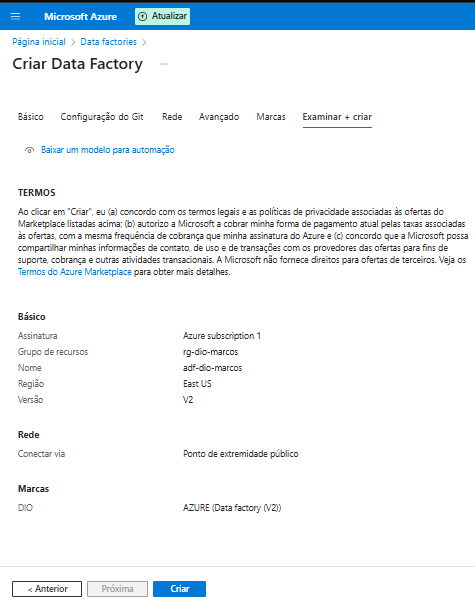

### 2. Configuração do Banco de Dados SQL Azure 💾

Criamos e configuramos o banco de dados SQL que servirá como nossa fonte de dados original.

  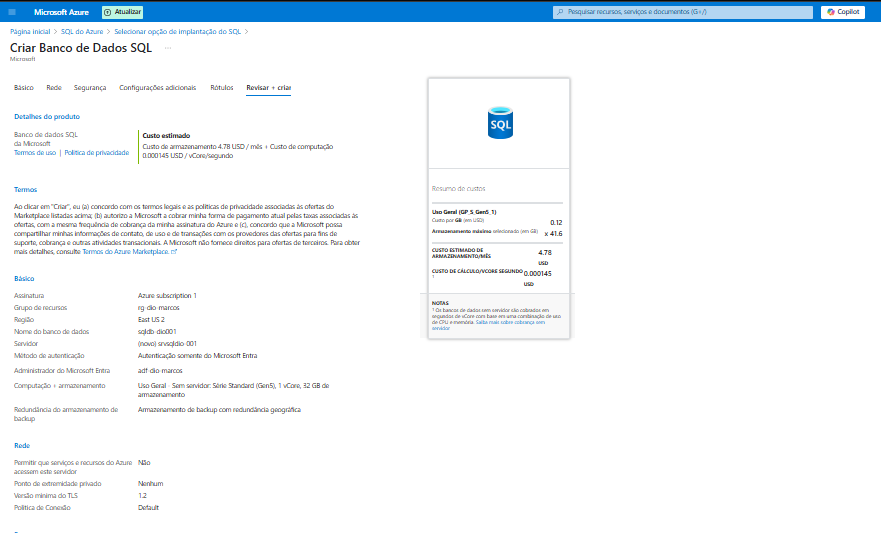

  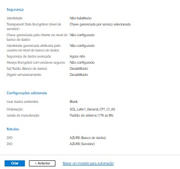

### 3. Provisionamento da Conta de Armazenamento (Storage Account) 📦

Configuramos a Conta de Armazenamento com Data Lake Storage Gen2 habilitado, definindo opções de redundância e segurança. Este será o nosso destino.

  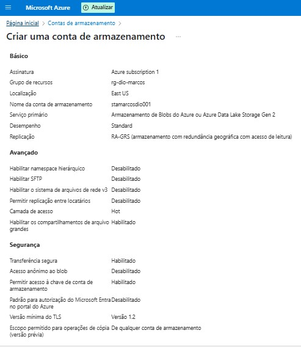

  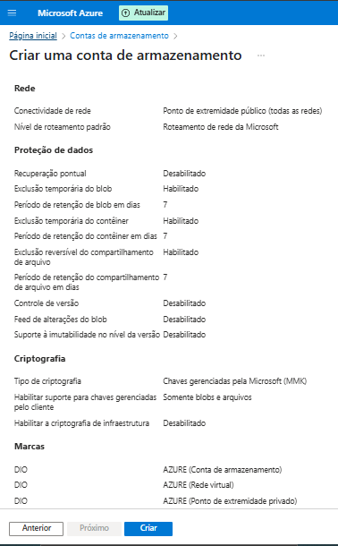

### 4. Criação dos Contêineres no Storage Account 🗂️

Organizamos nosso Data Lake criando contêineres (pastas) como `bronze`, `prata`, `ouro` e `logs`.

  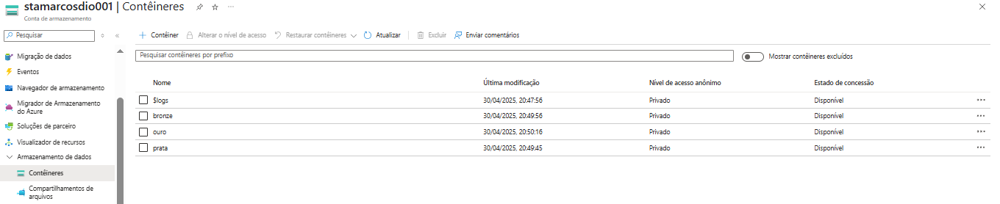

### 5. Configuração do Integration Runtime (IR) 🔌

Utilizamos o `AutoResolveIntegrationRuntime` padrão do Azure para conectividade na nuvem.

  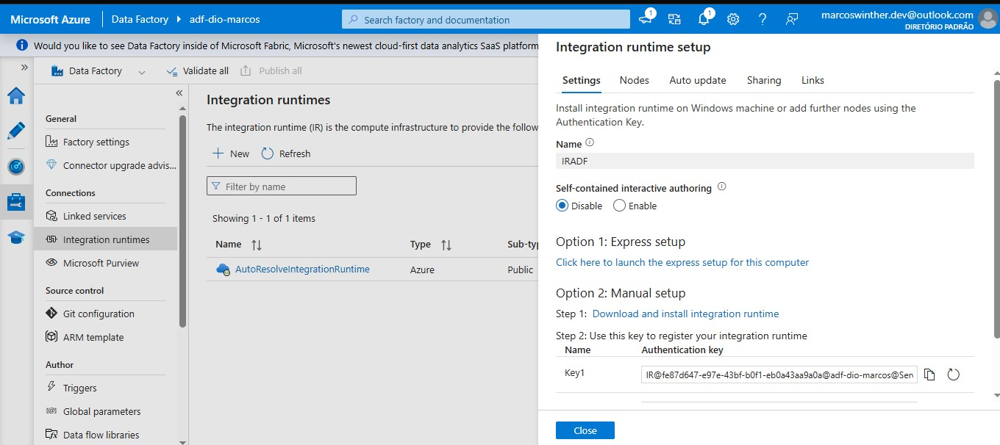

### 6. Configuração dos Linked Services 🔗

Definimos as conexões (Linked Services) no ADF para o nosso Banco de Dados SQL (fonte) e para o Data Lake Storage Gen2 (destino).

  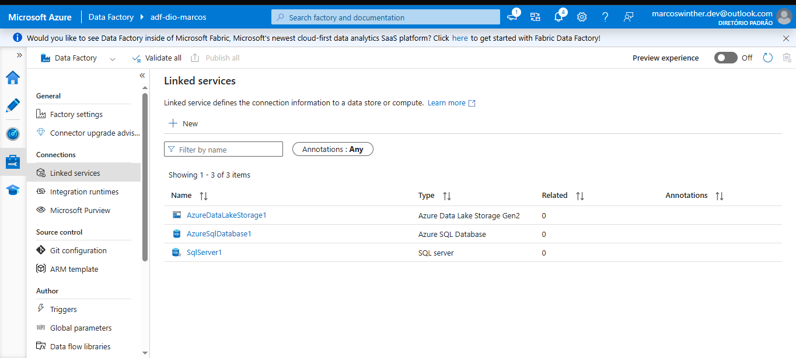

### 7. Construção do Pipeline de Cópia ⚙️➡️📄

Criamos o pipeline no ADF com uma atividade `Copy data` configurada para:
*   Ler dados da tabela especificada no Azure SQL Database (Source).
*   Gravar os dados como um arquivo de texto delimitado no contêiner `prata` do Data Lake (Sink).

  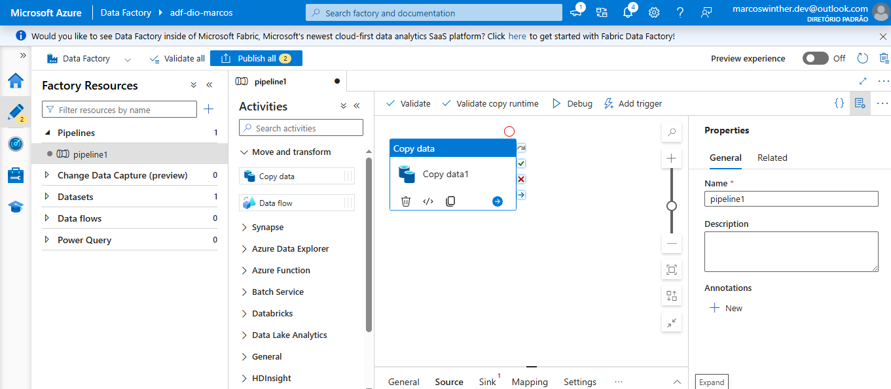

  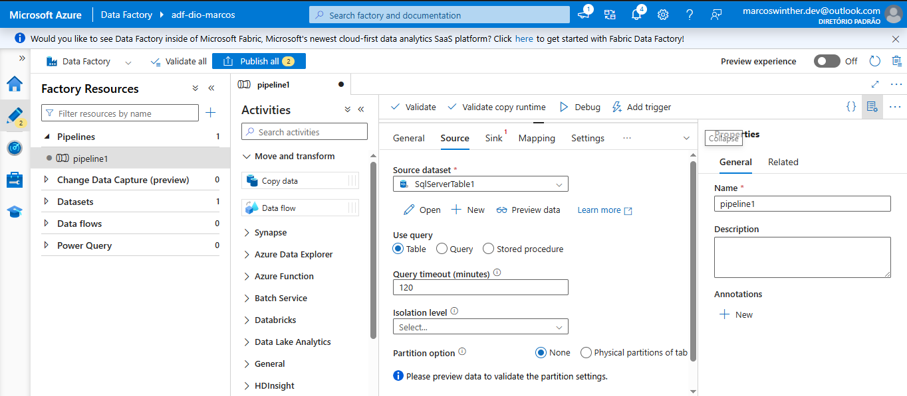

  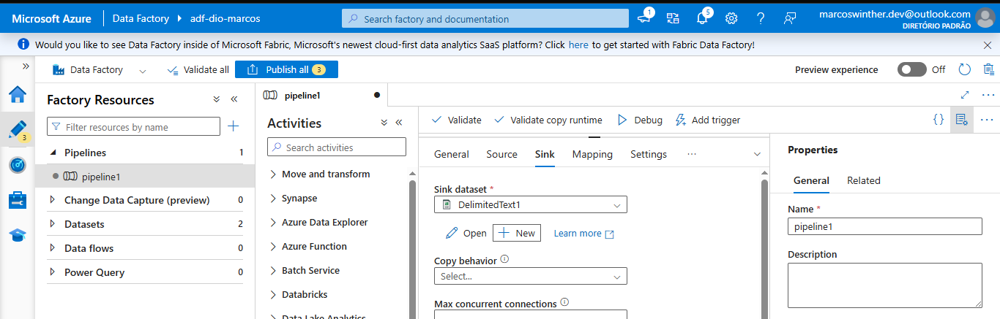

 

## ✅ Resultado

Após a configuração completa do pipeline, realizamos um teste de execução (`Debug`). A execução foi bem-sucedida 🎉, confirmando que a atividade de cópia leu os dados do Azure SQL Database e criou um novo arquivo correspondente no contêiner `prata` do Azure Data Lake Storage Gen2. Com isso, alcançamos o objetivo de criar uma redundância básica dos dados da fonte no Data Lake.

 

## 👨‍💻 Expert

    
    
&nbsp&nbsp&nbspMarcos Winther 
    &nbsp&nbsp&nbsp
    <a href="https://github.com/MarcosWinther">
    GitHub</a>&nbsp;|&nbsp;
    <a href="https://www.linkedin.com/in/marcoswinthersilva/">LinkedIn</a>
    

  

---

⌨️ com 💜 por [Marcos Winther](https://github.com/MarcosWinther)